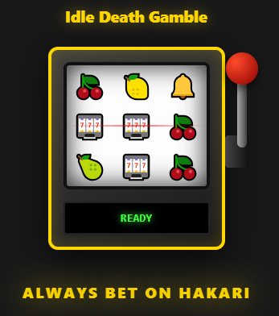

# 🎰 VS Code: Idle Death Gamble (Hakari Dance)

<p align="center">
  
  <br>
  <small><i>Hakari Dance</i></small>
  <br>
  <small><i>Credit: <a href="https://tenor.com/view/hakari-hakari-dance-jjk-jujutsu-kaisen-gif-2949665050985068692">Titan2</a></i></small>
</p>


> **"In the 4 minutes and 11 seconds following a jackpot, Hakari is effectively immortal."**

Turn your coding sessions into a high-stakes gamble. When you hit the jackpot, your workspace transforms into a legendary "Fever" state featuring **Tuka Donka** and Hakari’s iconic dance.

> [!WARNING]
> **Photosensitivity Warning:** This extension features fast-flashing colors and "Party Mode" visual effects. Use with caution if you are sensitive to flashing lights.
> 
> **Intentional Design:** In accordance with the lore, the jackpot **cannot be stopped** once it has begun until the 4:11 timer expires. Closing the sidebar or reloading the window are your only means of early termination.

## ⚡ Features

*   **Visual Slot Machine:** Interactive sidebar UI with smooth reel animations and a physical pull-handle experience.
*   **Jackpot Fever:** A strictly timed 4-minute and 11-second "Invincibility" phase with dancing Hakari and Phonk beats.

## 📦 Installation

### From VS Code Marketplace
1.  Open **Extensions** in VS Code (`Ctrl+Shift+X` / `Cmd+Shift+X`)
2.  Search for **"Idle Death Gamble"**
3.  Click **Install**

### From GitHub Releases (Manual Install)
1.  Go to the [Releases page](https://github.com/andrei2699/Hakari-Jackpot-VS-Code-Extension/releases)
2.  Download the latest `.vsix` file
3.  In VS Code, run **"Extensions: Install from VSIX..."** from the Command Palette.

### Via Command Line
Install from Marketplace:
```bash
code --install-extension andrei2699.hakari-idle-death-gamble
```

Install from local `.vsix`:
```bash
code --install-extension hakari-idle-death-gamble-1.3.0.vsix
```

## ⚙️ Configuration

Customize your gamble in VS Code settings:

*   `hakari.jackpotChance`: Probability of hitting a jackpot (default: `0.8`).
*   `hakari.feverSpeed`: Speed multiplier for flashing colors and effects (`0.1` - `5.0`).
*   `hakari.triggerOnTestSuccess`: Automatically roll when your tests pass.
*   `hakari.disableFlashingLights`: Toggle accessibility mode to disable flashing disco effects.

## ⚖️ License

The source code of this extension is licensed under the **MIT License**.

> This license does **NOT** apply to the media assets (audio, images, GIF) included in this repository. All assets are the property of their respective owners and are used here under fair use for transformative purposes. See [Credits](#📜-credits) for original sources.

## 📸 Screenshots



## 📜 Credits

*   **Music:** [TUCA DONKA [Brazilian Phonk] - CURSEDEVIL, DJ FKU, Skorde](https://www.youtube.com/watch?v=YDpNRw5geSA)
*   **Animation/GIF:** [Titan2](https://tenor.com/view/hakari-hakari-dance-jjk-jujutsu-kaisen-gif-2949665050985068692)
*   **Sound Effect:** [Slot Machine Jackpot](https://www.youtube.com/watch?v=qPwANcErhDU)
*   **Sound Effect:** ["Aw Dangit" uploaded by lia573](https://www.myinstants.com/en/instant/aw-dangit-56663/)
*   **Sound Effect:** ["Let's go gambling" uploaded hampter7](https://www.myinstants.com/en/instant/lets-go-gambling-96828/)
